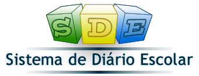
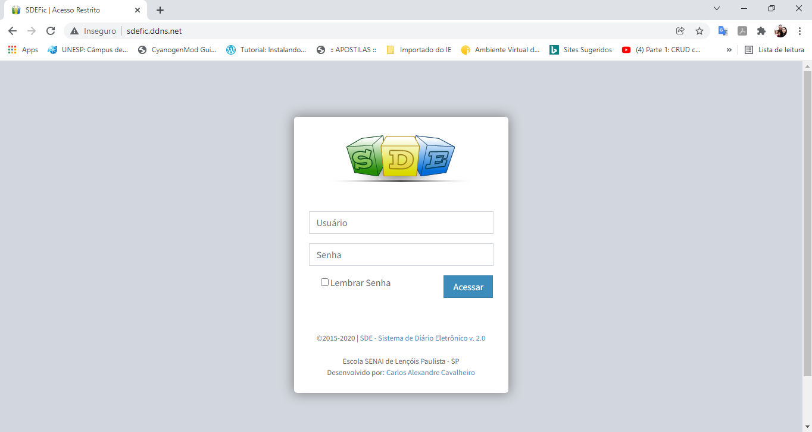
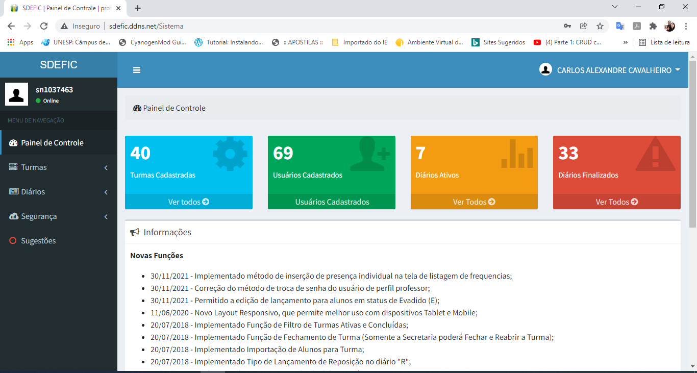
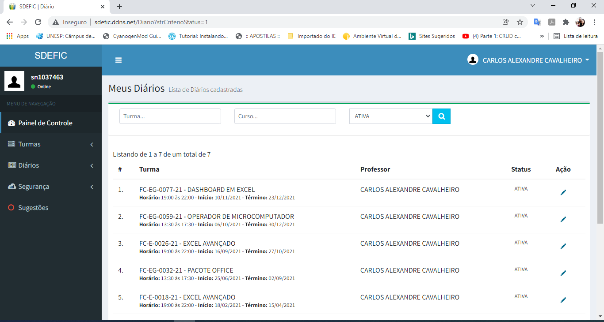
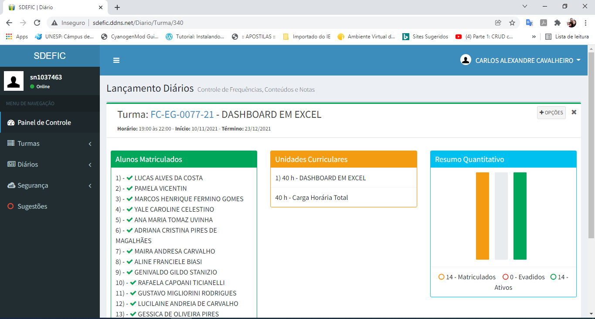
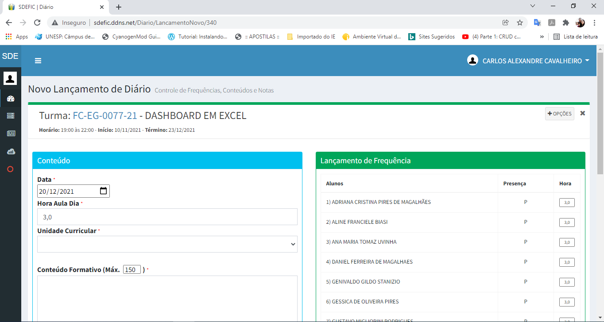
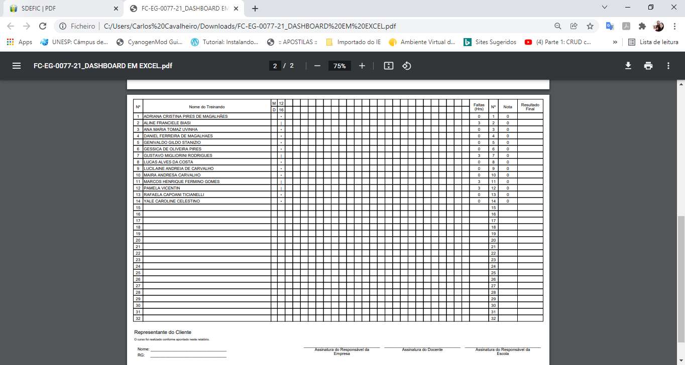
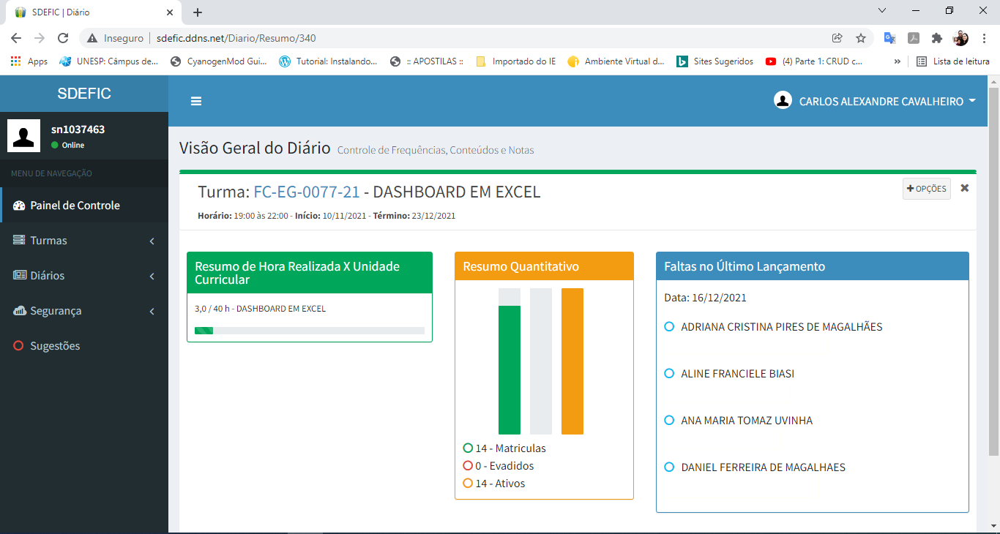

## DESCRIÇÃO DO PROJETO
Aplicação web que permite um controle de frequência, conteúdo de aulas, lançamento de notas, cadastro de turmas, cadastro de acessos, e relatórios;

## TECNLOGIAS
- HTML/CSS/JAVASCRIPT
- Bootstrap
- C# .NET (MVC)
- MySQL

## FUNÇÕES DA APLICAÇÃO
- [x] Cadastro de Acessos
- [x] Cadastro de Alunos;
- [x] Cadastro de Turma;
- [x] Cadastro/Importação .xlsx de Matriculas;
- [x] Cadastro de Cursos e Unidades Curriculares;
- [x] Lançamento de Diários (Frequências e Conteúdos);
- [x] Lançamentos de Notas;
- [x] Emissão de relatórios em PDF;

## TELAS DA APLICAÇÃO

## DESENVOLVEDOR

- Carlos Alexandre Cavalheiro
